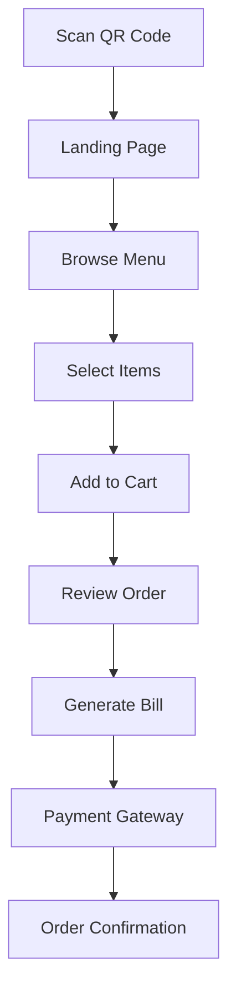
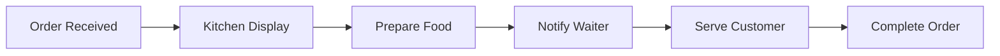

# 🍽️ QR-Based Food Ordering System

<div align="center">


*A modern, contactless dining solution that revolutionizes restaurant operations*

[Features](#-features) • [Demo](#-demo) • [Installation](#-installation) • [Tech Stack](#-tech-stack) • [Contributing](#-contributing)

</div>

---

## 📋 Overview

The **QR-Based Food Ordering System** is a comprehensive digital solution designed to streamline restaurant operations and enhance customer dining experiences. By simply scanning a QR code, customers can browse menus, place orders, and make payments without any physical contact or waiting for staff assistance.

### 🎯 Project Goals

- ✅ **Enhance Customer Experience** - Seamless, contactless ordering process
- ✅ **Streamline Operations** - Real-time order management and kitchen communication
- ✅ **Reduce Manual Errors** - Automated order processing and billing
- ✅ **Improve Efficiency** - Faster table turnovers and optimized workflows

---

## ✨ Features

### 👥 Customer Experience
```
🔍 Scan QR Code → 📱 Browse Menu → 🛒 Add to Cart → 💳 Pay Online
```

- **QR Code Access** - Each table has a unique QR code linking to the ordering system
- **Interactive Menu** - Browse dishes with images, descriptions, and prices
- **Smart Cart Management** - Easy item selection and quantity adjustment
- **Automated Billing** - Detailed bills with GST and service charges
- **Multiple Payment Options** - QR payments and direct app integration
- **AI-Powered Recommendations** - Personalized food combinations based on preferences

### 👨‍🍳 Kitchen & Service Staff
```
📋 Receive Orders → 🍳 Prepare Dishes → 🔔 Notify Waitstaff → 🍽️ Serve Customers
```

- **Real-time Order Display** - Kitchen dashboard showing active orders by table
- **Order Status Tracking** - Progress updates for each dish
- **Waiter Notifications** - Alerts when orders are ready for serving
- **Table Management** - Clear identification of table numbers and order details

### 🔧 Administrative Panel
```
📊 Dashboard → 🍕 Manage Menu → 💰 View Reports → 🗄️ Database Management
```

- **Menu Management** - Add, edit, or remove dishes with ease
- **Price Control** - Dynamic pricing updates
- **Sales Analytics** - Comprehensive reporting and insights
- **Database Administration** - User and order data management

---

## 🛠️ Tech Stack

<div align="center">

| Frontend | Backend | Database | Payment | AI/ML |
|----------|---------|----------|---------|-------|
|  |  |  |  |  |
|  |  | |  |  |
|  | | |  | |

</div>

---

## 🚀 System Architecture

### 📱 Customer Journey


### 🏪 Restaurant Operations


---

## 💡 Key Benefits

### 🔧 Technical Advantages
- **Error Reduction** - Automated processes minimize human mistakes
- **Real-time Updates** - Instant communication between all system components
- **Scalable Architecture** - Easy to expand and modify for growing needs
- **Cloud Integration** - Reliable and accessible from anywhere

### 🌟 Business Impact
- **Cost Efficiency** - Reduced staffing needs for order management
- **Faster Service** - Quicker table turnovers increase revenue
- **Customer Satisfaction** - Modern, convenient dining experience
- **Data Insights** - Analytics for better business decisions

### 🏥 Health & Safety
- **Contactless Operations** - Essential for post-pandemic dining
- **Hygiene Compliance** - Reduced physical touchpoints
- **Safety First** - Digital-first approach ensures customer safety

---

## 🎭 User Roles & Permissions

| Role | Permissions | Key Features |
|------|-------------|--------------|
| **👤 Customer** | Order, Pay, Review | QR Scanning, Menu Browsing, Payment |
| **👨‍🍳 Chef** | View Orders, Update Status | Kitchen Dashboard, Order Management |
| **🏃‍♂️ Waiter** | Serve Orders, Update Tables | Service Notifications, Table Status |
| **👨‍💼 Admin** | Full System Access | Menu Management, Analytics, User Control |

---

## 📈 Project Feasibility

### ✅ Technical Feasibility
- **Proven Technologies** - Using established, reliable tech stack
- **API Integration** - Seamless third-party service connections
- **Scalable Design** - Architecture supports future growth
- **Cross-platform** - Works on all devices and browsers

### 💰 Economic Viability
- **Cost-effective** - Open-source tools reduce development costs
- **ROI Positive** - Quick payback through operational efficiency
- **Low Maintenance** - Stable architecture requires minimal upkeep
- **Revenue Growth** - Improved customer experience drives sales

### 🌍 Social Impact
- **Modern Dining** - Meets contemporary customer expectations
- **Accessibility** - Easy-to-use interface for all age groups
- **Environmental** - Reduces paper waste from physical menus
- **Employment** - Creates new tech-focused job opportunities

---

## 🔄 System Flow

### Customer Side Process
1. **🔍 Scan QR** - Customer scans table QR code
2. **📱 Access Menu** - Redirected to restaurant's digital menu
3. **🛒 Place Order** - Select items and add to cart
4. **🧾 Review Bill** - Automatic bill generation with all charges
5. **💳 Payment** - Secure online payment processing
6. **✅ Confirmation** - Order confirmed and sent to kitchen

### Restaurant Operations
1. **📋 Order Receipt** - Kitchen receives order details
2. **👨‍🍳 Food Preparation** - Chef prepares ordered items
3. **🔔 Service Alert** - Waiter notified when food is ready
4. **🍽️ Table Service** - Food delivered to correct table
5. **📊 Analytics** - Admin tracks performance metrics

---

## 🤝 Contributing

We welcome contributions from the community! Here's how you can help:

1. **🍴 Fork** the repository
2. **🌟 Create** a feature branch (`git checkout -b feature/AmazingFeature`)
3. **💾 Commit** your changes (`git commit -m 'Add some AmazingFeature'`)
4. **📤 Push** to the branch (`git push origin feature/AmazingFeature`)
5. **🔄 Open** a Pull Request

---

## 📞 Support & Contact

<div align="center">

**Need Help?** We're here to assist you!

[](mailto:support@qrfoodordering.com)
[](https://discord.gg/qrfoodordering)
[](https://docs.qrfoodordering.com)

</div>

---

<div align="center">

**Made with ❤️ for modern dining experiences**

*Transforming restaurants, one QR code at a time* 🍽️✨

</div>